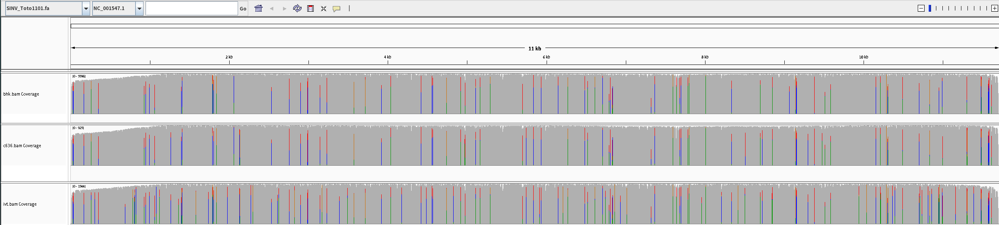
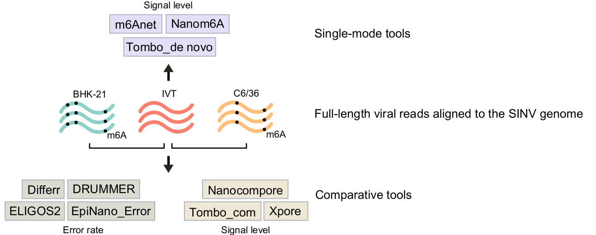

# DRS_viral_RNA_modification_scripts

Utilization of Nanopore Direct RNA Sequencing to analyze intracellular viral RNA modifications of the Sindbis virus

This git saved the main functions and scripts used in our paper.
## Dataset 
Our Direct RNA sequencing(DRS) data was uploaded to the [figshare](https://figshare.com/account/home#/projects/167354)

## RNA modification detection tools based on ONT

All ten methods shells we ran were recorded [here](tackle_subsample_data/pipeline_all_method.md)

## Data available
[Review link](https://dataview.ncbi.nlm.nih.gov/object/PRJNA983926?reviewer=2evbg8unroe7c1juoo8a2p67bs)